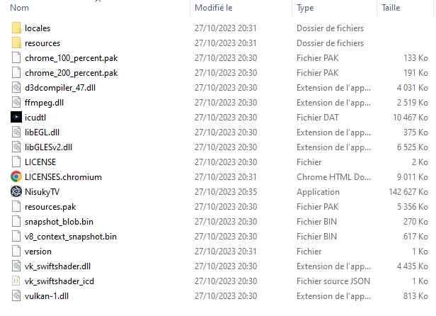

# Nisuky App - Version Bêta

## Utilisation

Pour éxécuter cette application, vous n'avez pas besoin de programme particulier. 

## Installation

Afin d'utiliser ce programme, vous devez posséder Windows avec l'architecture x64

Vu que l'application est simplement compilée et zippée par Github, vous devez dézipper le fichier sur votre session utilisateur Windows et ensuite ouvrir le fichier nommé: **NisukyTV**

- Si votre Antivirus bloque l'installation, c'est normal, nous ne sommes pas reconnus par Windows pour diffuser l'application. 
Nous avons effectué au préalable plusieurs tests de l'application au sein de logiciels antivirus.

    ### .EXE ABSENT SUR GITHUB

Le .exe à été déplacé sur ***GOOGLE DRIVE*** car trop lourd pour la plateforme. 

Le document est donc accessible ici: [GOOGLE DRIVE - Accéder au .EXE](https://drive.google.com/drive/folders/1xIU3fSszpjsk6CQkh2T20slFh2lMVBK4?usp=sharing)

Le document .exe , une fois l'appli dézippée doit être directement intégré dans le répertoire racine du fichier.

Aidez vous de l'image suivante!

## Version

Ce logiciel est en Version 0.0.3.760 BÊTA

## Description

Avec NisukyTV, retrouvez toutes les actualités de la chaîne YouTube de Nisuky! 
Des actualités en avant-première, des vidéos en avant-première (*abonnement premium requis* **non déployé**) et bien plus! Des historiques de lives, de vidéos avec des avis personnalisés par le créateur, et des infos EXCLUSIVES!

Restez informé car le projet arrive prochainement en version Définitive! 

## Disponibilités:

Le programme est disponible/utilisable pour les appareils suivants:
- IOS (Indisponible) 
- Mac (Indisponible)
- Android (En cours de configuration)
- Windows (Version Bêta)

## Précisions

Pour rappel, cette application est pour l'instant produite à but purement "divertif" et n'est pas reconnue par conséquent comme application professionnelle et de "référence". Une application plus performante pourra être développée par le futur.

Cette application n'intègre pas encore de plateforme "UTILISATEUR". Cela sous-entend qu'aucun compte officiel n'est attribué sur l'application. 
***DES BUGS IMPORTANTS PEUVENT SURVENIR EN RAISON DE LA TENTATIVE DE DEPLOIEMENT EN COURS D'UN SYSTEME DE MISES A JOURS AUTOMATIQUES.***